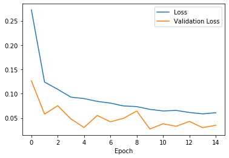

In this project, I try to get highest possible score in Kaggle [Digit Recognizer](https://www.kaggle.com/c/digit-recognizer) competition.

Here is the loss and validation loss figure, where the weights were saved at the lowest validation score rate in order to obtain highest accuracy score.

Highest submission accuracy I obtain using this homemade deep learning architecture is 0.99328, which put me #600 among 2900 teams.

